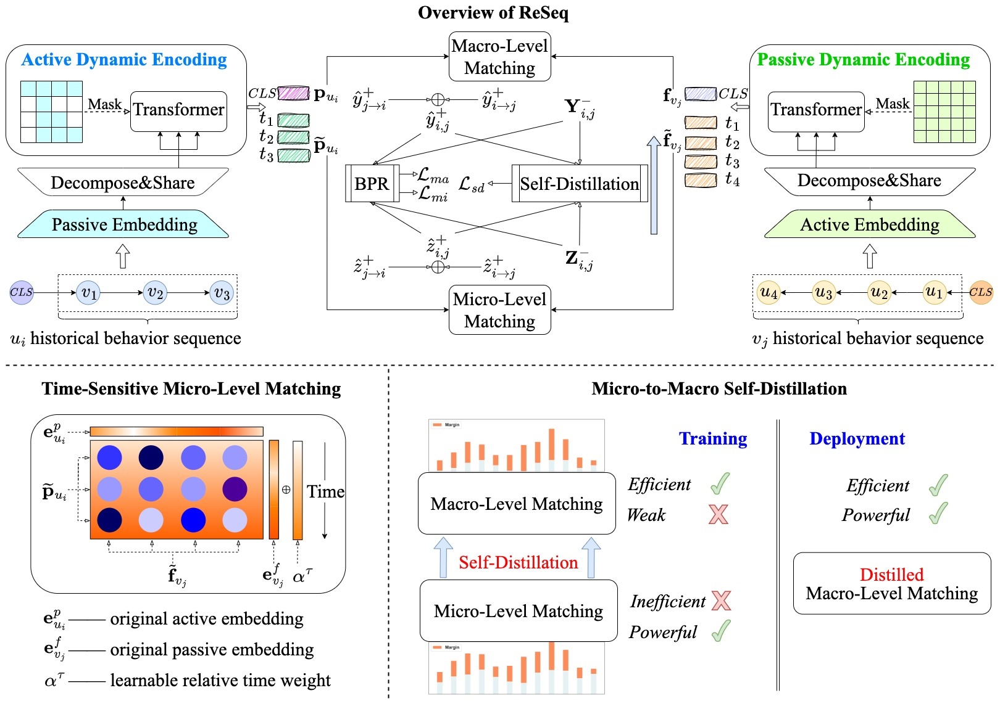

# ReSeq

This is the official PyTorch implementation for the paper:

> Reciprocal Sequential Recommendation. RecSys 2023

## Overview

We proposes a reciprocal sequential recommendation method, named **ReSeq**, in which we formulate reciprocal recommendation as a distinctive sequence matching task and perform matching prediction based on bilateral dynamic behavior sequences.

## Requirements

```
torch==1.10.1+cu113
cudatoolkit==11.3
```

## Dataset

`dataset_path` in `config.yaml` should contain the following files:

```
dataset_path/
├── {train/valid_user/valid_item/test_user/test_item}.pkl
├── {user_his/item_his}.pkl
└── {user_token/item_token}.pkl
```

### Run

```
cd ./run
python auto_run.py
```

## Acknowledgement

The implementation is based on the open-source recommendation library [RecBole](https://github.com/RUCAIBox/RecBole) and [RecBole-PJF](https://github.com/RUCAIBox/RecBole-PJF).

Please consider citing the following papers as the references if you use our code.

```
@article{zheng2023reseq,
  title = {Reciprocal Sequential Recommendation},
  author = {Bowen Zheng and Yupeng Hou and Wayne Xin Zhao and Yang Song and Hengshu Zhu},
  journal={arXiv preprint},
  year={2023}
}

@inproceedings{zhao2021recbole,
  title={Recbole: Towards a unified, comprehensive and efficient framework for recommendation algorithms},
  author={Wayne Xin Zhao and Shanlei Mu and Yupeng Hou and Zihan Lin and Kaiyuan Li and Yushuo Chen and Yujie Lu and Hui Wang and Changxin Tian and Xingyu Pan and Yingqian Min and Zhichao Feng and Xinyan Fan and Xu Chen and Pengfei Wang and Wendi Ji and Yaliang Li and Xiaoling Wang and Ji-Rong Wen},
  booktitle={{CIKM}},
  year={2021}
}

@inproceedings{zhao2022recbole,
  title={RecBole 2.0: Towards a More Up-to-Date Recommendation Library},
  author={Zhao, Wayne Xin and Hou, Yupeng and Pan, Xingyu and Yang, Chen and Zhang, Zeyu and Lin, Zihan and Zhang, Jingsen and Bian, Shuqing and Tang, Jiakai and Sun, Wenqi and others},
  booktitle={{CIKM}},
  year={2022}
}
```
